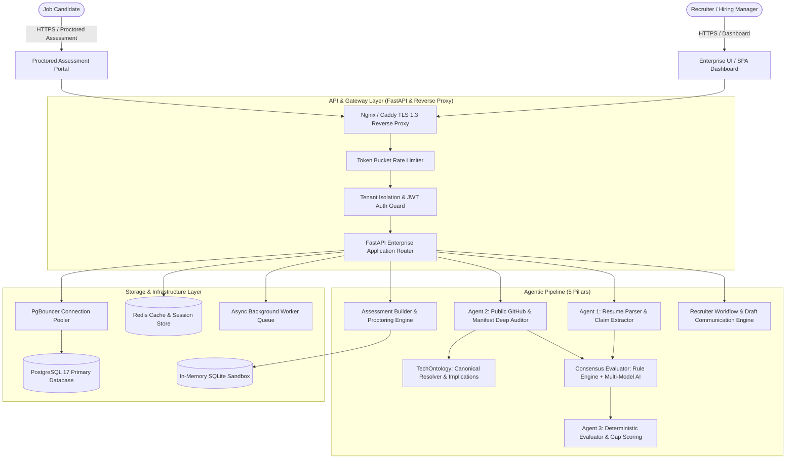
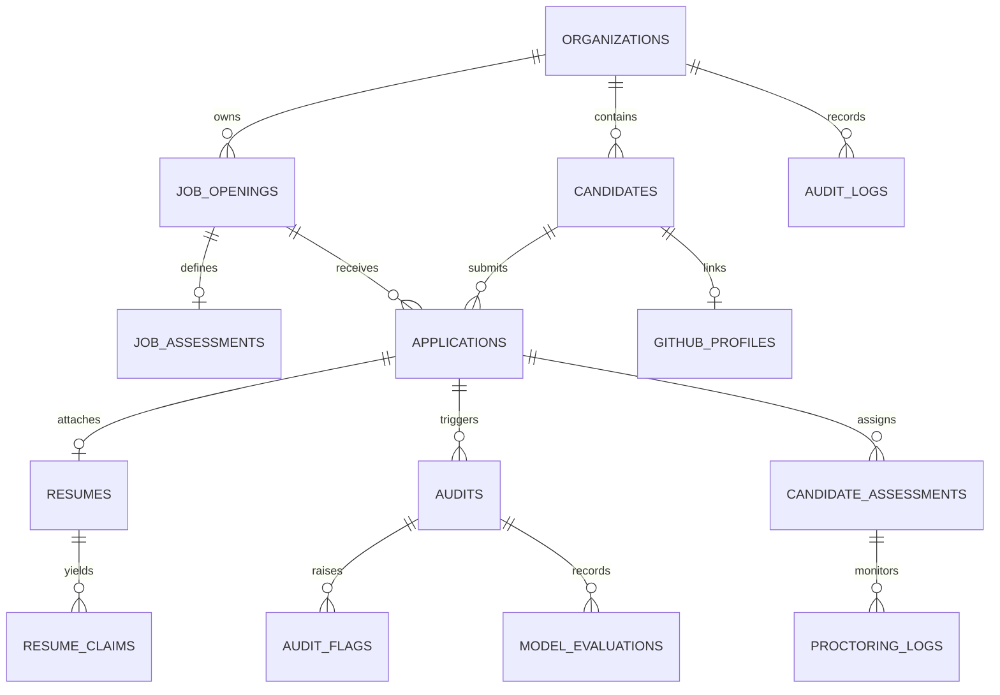

# AuditAgent Enterprise System Architecture

## Executive Overview
**AuditAgent** is a multi-agent AI hiring and technical evaluation platform engineered to eliminate resume fraud, provide deterministic technical skill verification, execute secure multi-modal proctored coding assessments, and streamline recruiter decision workflows with strict legal compliance (NYC Local Law 144, EEOC, GDPR).

---

## 1. High-Level System Architecture

---

## 2. The 5 Core Agentic Pillars

### Pillar 1: Resume Parsing & Multi-Modal Claim Extraction (`Agent 1`)
- **Input**: Raw PDF, DOCX, or text resume uploaded by recruiter or candidate.
- **Engine**: `pypdf`, structured regular expressions, and LLM structured extraction via Pydantic schemas.
- **Validation Gate**:
  - Documents are pre-screened to verify they represent legitimate professional CVs.
  - Classifies document types (`RESUME`, `ACADEMIC_EXERCISE`, `LAB_EXPERIMENT`, `UNRELATED_DOCUMENT`).
  - Halts the audit immediately if non-resume content is uploaded, preventing hallucinated scoring.
- **Categorized Claims Output**:
  - `claimed_languages`: (e.g. Python, TypeScript, Go)
  - `claimed_frameworks`: (e.g. FastAPI, React, Next.js)
  - `claimed_databases`: (e.g. PostgreSQL, Redis, MongoDB)
  - `claimed_cloud_devops`: (e.g. Docker, Kubernetes, AWS, Terraform)
  - `claimed_tools`: (e.g. Git, Pytest, Celery)
  - `work_history` & `projects`: Chronological career timeline and claimed impact.

### Pillar 2: Public Evidence & Manifest Deep Audit (`Agent 2`)
- **Input**: Candidate GitHub username / URL (extracted from resume or manually entered).
- **Safe Input Sanitization**: Rejects non-GitHub domains, path traversals, and illegal characters.
- **Deep Manifest Inspection**:
  - Unlike superficial language checks that only read top-level language stats, Agent 2 inspects repository manifest files:
    - `Dockerfile`, `docker-compose.yml` $\implies$ Proves containerization (`Docker`).
    - `requirements.txt`, `Pipfile`, `poetry.lock` $\implies$ Proves database drivers (`psycopg2`, `asyncpg` for PostgreSQL).
    - `package.json` $\implies$ Proves frontend/backend dependencies (`react`, `next`, `tailwindcss`).
    - `go.mod`, `Cargo.toml` $\implies$ Proves compiled backend dependencies.
- **Canonical Technology Ontology (`TechOntology`)**:
  - Standardizes 300+ technology aliases (e.g. `postgres`/`psql` $\implies$ `PostgreSQL`).
  - Infers implied competencies (e.g. `FastAPI` $\implies$ `Python`, `Next.js` $\implies$ `React/TypeScript`).
- **Safe Neutral Baselines**: If candidate lacks public GitHub, status is recorded as `Unavailable` (not penalized or rejected), preventing bias against enterprise engineers under NDAs.

### Pillar 3: Multi-Model Consensus Evaluation & Anomaly Detection
- **Consensus Loop**:
  - Combines deterministic rule-based evaluation with multi-model AI arbitration (e.g. Qwen 2.5 Coder 32B, Nemotron 3 Ultra).
  - Enforces `temperature=0.0` for zero-drift reproducibility.
  - Computes multi-evaluator score variance.
- **Human-in-the-Loop Gate**:
  - If multi-model variance exceeds 20 points, the candidate is automatically flagged (`needs_manual_review = True`) for human recruiter review.

### Pillar 4: Secure Proctored Assessment Engine
- **Role Tracks**: 20 specialized engineering tracks (Software Engineer, Data Engineer, Frontend, DevOps, etc.).
- **Assessment Composition**:
  - **10 Core Fundamentals MCQs** (`mcq_fundamentals`)
  - **10 System Architecture MCQs** (`mcq_architecture`)
  - **2 Algorithmic DSA Coding Challenges** (`dsa_algorithms`) with starter code and hidden unit test suites.
  - **1 Code Bug Fixing & Debugging Challenge** (`code_debugging`)
  - **1 In-Memory SQL Query Challenge** (`sql_window_cte`) evaluated in an isolated SQLite sandbox.
- **Integrity & Proctoring Shield**:
  - WebRTC camera presence monitoring with face count tracking.
  - Fullscreen lock and tab-blur / visibility change detection.
  - Keystroke dynamics and copy-paste velocity anomaly logging.

### Pillar 5: Recruiter Decision Pipeline & Audit Trail
- **Automated Scorecard**:
  - Standardized sub-scores: `Skills Match (0-100)`, `Code Quality (0-100)`, `Consistency (0-100)`, `Company Required Skills Match (0-100)`.
  - Recruiter Actions: `STRONG_CANDIDATE` (Schedule Interview), `REVIEW` (Request Portfolio), `NOT_RECOMMENDED` (Polite Rejection).
- **Automated Draft Communication**: Pre-generates personalized interview invites or polite status updates referencing verified repository highlights.
- **Cryptographic Audit Log**: Every screening, assessment submission, and status override is committed to an immutable log with SHA-256 hash chaining.

---

## 3. Database Entity-Relationship Model

---

## 4. Security & Tenant Isolation

1. **Multi-Tenant Scoping**:
   - Every database query enforces `organization_id = current_org.id` via SQLAlchemy session filters.
   - Cross-tenant access is strictly blocked at the routing layer with HTTP 403 Forbidden.
2. **PII Data Encryption**:
   - Candidate names, emails, phone numbers, and raw resume texts are stored with field-level encryption or restricted database access roles.
3. **Execution Sandboxing**:
   - Algorithmic code and SQL evaluations run in temporary, ephemeral in-memory sandboxes with strict CPU and execution time limits (10-second hard cutoff).
   - Python code execution runs without disk write permissions or outbound network access.
